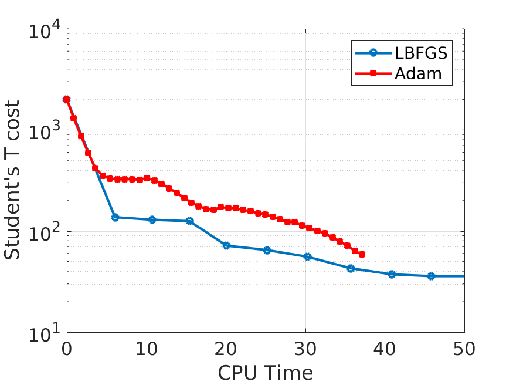

# Radio interferometric calibration with PyTorch
This is a simple example to compare popular optimizers used in deep learning (Adam etc.) with stochastic LBFGS.

The stochastic LBFGS optimizer is provided with the code. Further details are given [in this paper](https://ieeexplore.ieee.org/document/8755567). Also see [this introduction](http://sagecal.sourceforge.net/pytorch/index.html).

Files included are:

``` lbfgsnew.py ```: New LBFGS optimizer

``` run_calibration.py ```: Run a simple calibration



Here is an image showing the reduction of calibration error (Student's T loss) with iteration for LBFGS and Adam. Adam runs faster but slower to converge. LBFGS uses 4 epochs and Adam uses 24 epochs in the image.